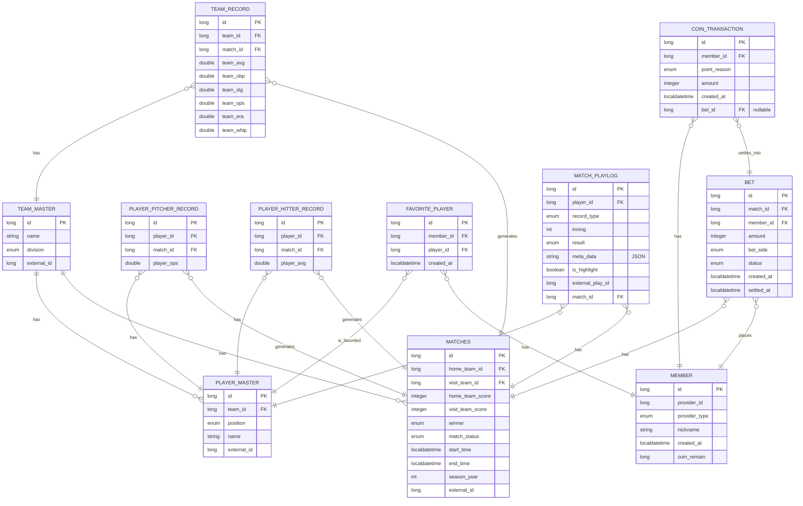
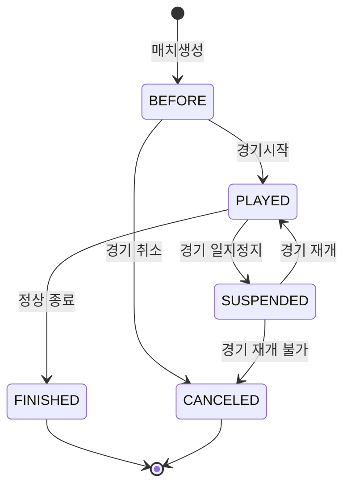
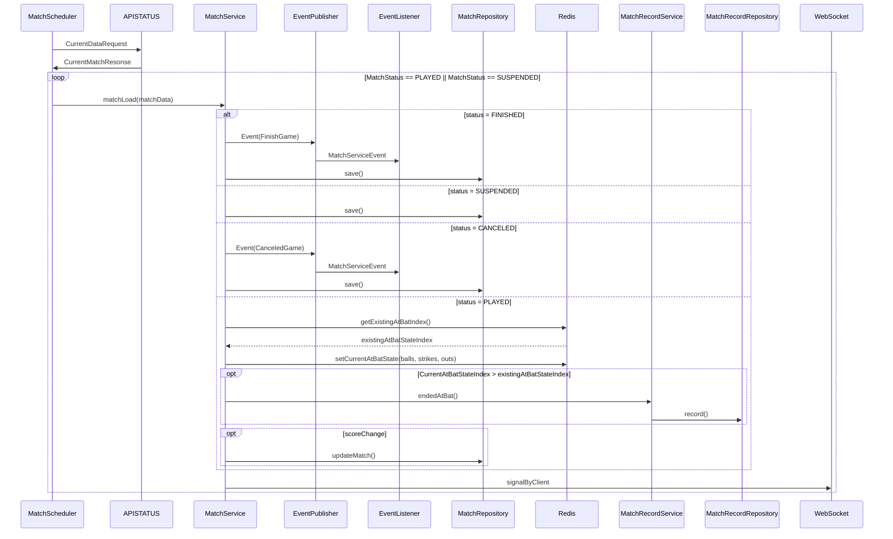
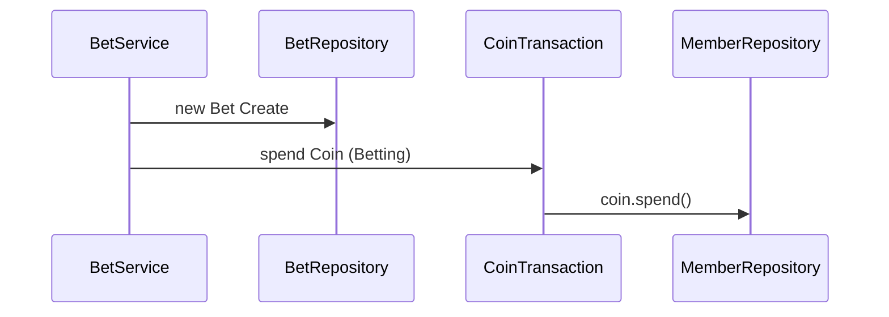
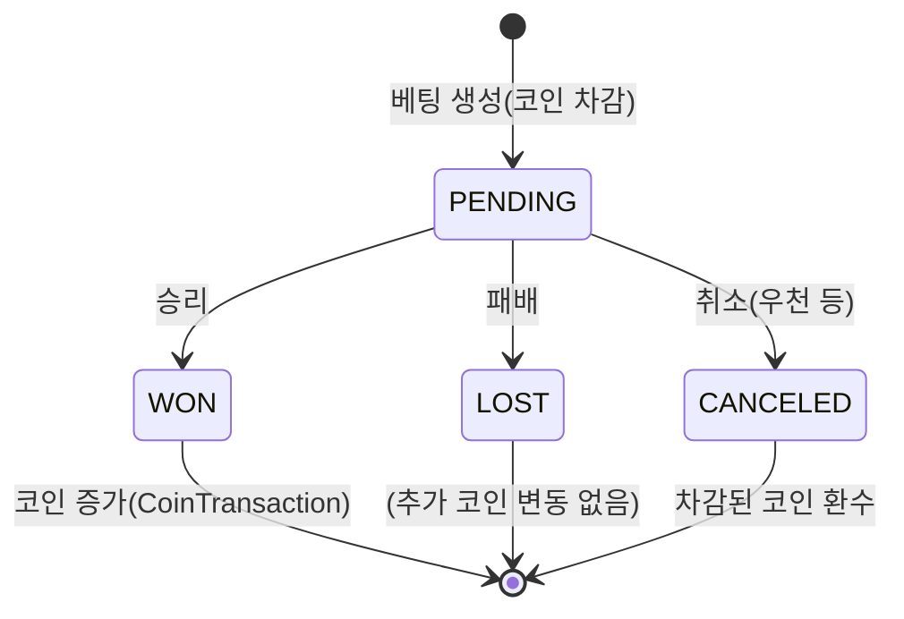
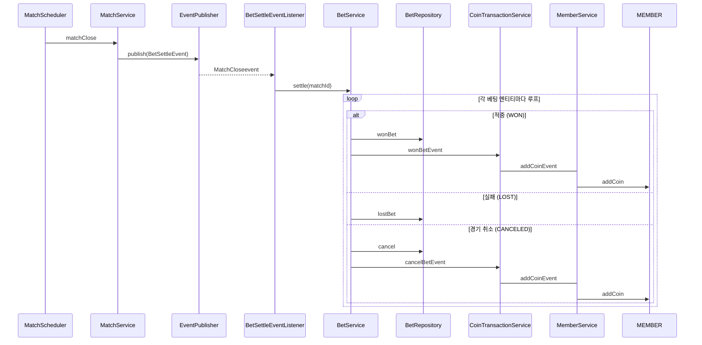

# MLB 승부예측 사이트 (가명)

## 소개

MLB API를 활용해 경기 진행 상황을 실시간 중계하고, 사용자는 원하는 팀에 베팅한다. 베팅한 팀이 승리하면 서비스 내 코인을 보상으로 획득한다.

## 주요 기능

### 실시간 경기 중계
- 경기 상태(프리게임/진행중/종료), 이닝, 득점, 주요 이벤트(안타/홈런/투수교체 등) 업데이트
- 경기별 채팅 시스템

### 최애 선수 시스템
- 최애 선수를 지정 가능 (최대 3명)
- 가장 최애가 많은 선수는 메인 페이지에 표시

### 베팅
- 경기 단위로 "승리 팀 맞히기" 형태
- 베팅은 경기 전, 경기 시작 후 최대 8이닝 전까지 가능. 단, 경기 시작 후 진행된 이닝에 따라 포인트 지급량 감소 (현재는 경기 시작 전에만 가능한 형태로 변경할지 고민 중)
- 최애 선수를 지정하여 해당 선수가 POG(Player Of Game)일 경우 추가 포인트 및 해당 경기에 대한 뱃지 획득
- POG는 경기 결과에 대한 프롬프트를 OpenAI로 분석하여 선정

### 정산 및 보상 (코인)
- 경기 종료 시점 기준으로 승/패 판정
- 적중 시 코인 지급, 실패 시 코인 차감

### 코인 시스템
- 코인으로 칭호, 프로필 아이콘, 마이페이지 내 다양한 치장 아이템 등을 구매 가능

## ERD

### Enum

| Enum | 값 |
|---|---|
| Division | AL_EAST, AL_CENTRAL, AL_WEST, NL_EAST, NL_CENTRAL, NL_WEST |
| PlayerPosition | PITCHER, CATCHER, FIRST_BASE, SECOND_BASE, THIRD_BASE, SHORTSTOP, LEFT_FIELD, CENTER_FIELD, RIGHT_FIELD, DESIGNATED_HITTER |
| Provider | GOOGLE, KAKAO, NAVER |
| MatchStatus | BEFORE, PLAYED, FINISHED |

## DIAGRAM
### ERD



## 디렉토리 구조


```
src/main/java/com/mlbbroadcast
├── MlbBroadcastApplication.java
├── bet                 # 베팅
│   ├── Bet.java
│   ├── BetRepository.java
│   └── BetStatus.java
├── coin                # 코인 정산/지급
│   ├── CoinTransaction.java
│   ├── CoinTransactionRepository.java
│   └── PointReason.java
├── common              # 여러 도메인이 공유하는 타입 (예: 홈/원정 side)
│   └── Side.java
├── match                # 경기, 경기 중계 로그
│   ├── Matches.java
│   ├── MatchesRepository.java
│   ├── MatchPlaylog.java
│   ├── MatchPlaylogRepository.java
│   ├── MatchStatus.java
│   └── PlayResult.java
├── member              # 회원
│   ├── Members.java
│   ├── MembersRepository.java
│   └── Provider.java
├── player              # 선수 마스터/기록/최애 선수
│   ├── FavoritePlayer.java
│   ├── FavoritePlayerRepository.java
│   ├── PlayerHitterRecord.java
│   ├── PlayerHitterRecordRepository.java
│   ├── PlayerMaster.java
│   ├── PlayerMasterRepository.java
│   ├── PlayerPitcherRecord.java
│   ├── PlayerPitcherRecordRepository.java
│   └── PlayerPosition.java
└── team                 # 팀 마스터/기록
    ├── Division.java
    ├── TeamMaster.java
    ├── TeamMasterRepository.java
    ├── TeamRecord.java
    └── TeamRecordRepository.java
```

> controller / service / dto는 아직 구현되지 않아 위 구조에서 제외했다. 추가되면 각 도메인 패키지 하위에 함께 위치시킬 예정이다.


----
### MATCH DIAGRAM

#### STATE DIAGRAM

#### SequenceDiagram



----
### BETTING DIAGRAM


#### STATE DIAGRAM

#### BetCreate


#### BetTransaction



#### SEQUENCE DIAGRAM



## ADR
- API호출은 폴링 형식으로 저장하며, 외부 API에서 접근하는 INDEX에 맞춰 필요한 내용만 저장.
- 실시간성 데이터(현재 타석)은 Redis 메모리를통해 캐시화 한 뒤, 타석이 끝난뒤 db 폴링
- `player_hitter_record`, `player_pitcher_record`, `team_record` 에는 공통으로 sanson_year 칼럼을 통한 의도적 비 정규화.  → 정규화 시, 빈도가 잦은 쿼리에서 조인이 비효율적으로 자주 발생.  세 엔티티는  matches의 season_year이 파생되어 정합성 유지.
- 디렉토리 설계는 도메인 위주로 설계하여 유연한 확장이 가능하게 설계
- MatchService -> BetService 는 이벤트 리스너를 이용하여 추후 확장 설계를 대비. coinTransaction->memberService는 같은 트랜잭션 안에 일관되고 빠르게 처리되어야 하기 때문에 직접 호출  
